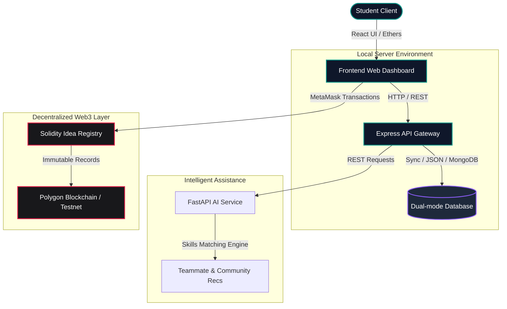
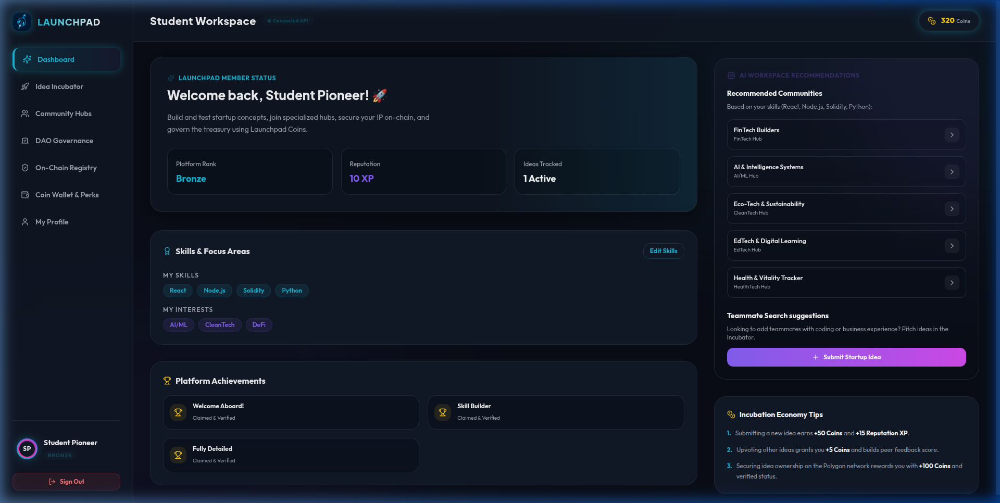
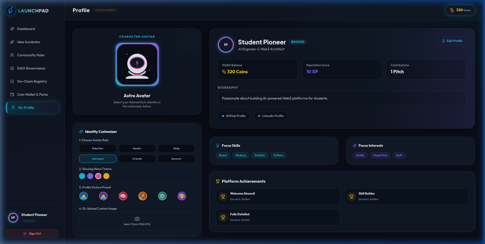
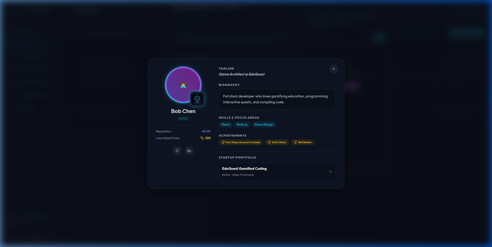

# Virtual Startup Launchpad

<p align="center">
  <b><a href="./README.md">🏠 Home</a></b> •
  <b><a href="./ROADMAP.md">🛣️ Roadmap</a></b> •
  <b><a href="./CONTRIBUTING.md">🤝 Contributing</a></b> •
  <b><a href="./CODE_OF_CONDUCT.md">📜 Code of Conduct</a></b> •
  <b><a href="./LICENSE">⚖️ License</a></b>
</p>

<p align="center">
  
  
  
  
  
</p>


Virtual Startup Launchpad (Startora) is a web-based innovation ecosystem designed to help students transform ideas into startups through collaboration, community engagement, AI-powered insights, and decentralized governance.

The platform acts as a virtual incubator where students can submit startup ideas, join communities, build teams, earn rewards, and receive feedback from peers and mentors. Unlike traditional project-sharing platforms, Virtual Startup Launchpad introduces a coin-based economy, AI-driven recommendations, and blockchain-backed idea ownership to create a transparent and innovation-focused environment.

---

## 📖 Table of Contents

- [Problem Statement](#-1-problem-statement)
- [Features](#-2-features)
- [Tech Stack](#-3-tech-stack)
- [Architecture](#-4-architecture)
- [Screenshots](#-5-screenshots)
- [Installation](#-6-installation)
- [Future Improvements & Roadmap](#-7-future-improvements--roadmap)
- [Community & Contributing](#-8-community--contributing)

---

## 🎯 1. Problem Statement

Many students have innovative startup ideas but struggle to find:
* **Like-minded teammates** with complementary skills.
* **Technical collaborators** to construct prototypes.
* **Mentors & Feedback** to assess viability.
* **Proof of idea ownership** (intellectual property protection).
* **A structured platform** to develop, track, and showcase progress.

Virtual Startup Launchpad addresses these challenges by providing a centralized, gamified ecosystem for startup creation and collaboration.

---

## ✨ 2. Features

### Core Modules
* **Student Profile System**: Personalized student profiles detailing skills, interests, achievements, and project portfolio. Includes community participation tracking and a reputation ranking system.
* **Community-Based Collaboration**: Join startup-focused communities for idea discussions, brainstorming, team formation, networking, and leaderboards.
* **Startup Idea Submission**: Pitch innovative ideas, categorize them by domain, and track progress and development stages with community feedback and voting.
* **Virtual Coin Economy**: Earn coins through community participation, idea contributions, mentoring, and team collaboration. Coins can be used for platform rewards and DAO governance.
* **AI-Powered Recommendation System**: Suggests suitable communities, recommends teammates based on complementary skills, and provides feasibility insights for startup ideas.
* **Blockchain-Based Idea Ownership**: Generates a unique hash for each idea submission and stores ownership records on-chain for immutable intellectual property proof.
* **DAO-Based Voting System**: Community members vote on startup funding proposals, community decisions, feature requests, and promotional campaigns.
* **Startup Ranking Dashboard**: Leaderboards tracking top contributors, community rankings, innovative ideas, and coin balances.

### Extended Customization & Gamification (Recent Additions)
* **Themed SVG Character Avatars**: Select a role-based identity (*Robo Dev, Hacker, Ninja, Astronaut, AI Synth, Sorcerer*).
* **Glowing Neon Themes**: Customize glowing outlines with choices like *Teal, Violet, Pink, or Gold*.
* **Visual Uploads**: Upload profile pictures converted automatically to base64 encoding or choose from 6 preset options.
* **Social Links Integration**: Directly link GitHub and LinkedIn profiles.
* **Coin Rewards**: Profile completion checks automatically unlock the **"Fully Detailed"** achievement and grant 50 Launchpad Coins.
* **Interactive Modals**: Student names in comments, community discussion channels, and ideas pitches are clickable, showing their reputation points (XP), ranking, unlocked achievements, and startup portfolio.

---

## 🛠️ 3. Tech Stack

* **Frontend**: React.js, Tailwind CSS, React Router, Axios, Lucide Icons.
* **Backend**: Node.js, Express.js, JWT Authentication.
* **Database**: Dual-mode storage (JSON fallback databases or MongoDB Atlas integration).
* **AI Module**: Python, FastAPI, Scikit-learn / XGBoost.
* **Blockchain Layer**: Solidity, Polygon Network, MetaMask Integration, Ethers.js.

---

## 📐 4. Architecture

Below is the interaction and component workflow diagram of the Virtual Startup Launchpad ecosystem:



### System Workflow
1. **Student Registration & Welcome**: Account creation triggers a default welcome coin bonus.
2. **Profile Customization**: Students build their profile (skills, avatar, bio) which unlocks gamified achievements.
3. **Idea & Pitch Creation**: Startup ideas are registered and hashed.
4. **On-Chain Registry**: The unique idea hash can be logged to smart contracts for immutable IP verification.
5. **AI Analysis**: Feasibility reports are generated automatically.
6. **Community Collaboration**: Discussions, feedback, and team creation with complementary skill sets.
7. **DAO Governance**: Voting on startup funding and platform parameters.

---

## 📸 5. Screenshots

### User Dashboard


### Extended Profile Settings & Avatars


### Clickable Public Student Profiles


---

## 💻 6. Installation

Follow these instructions to set up the repository locally.

### Prerequisites
* Node.js (v16+)
* npm
* Python (v3.8+)

### Step 1: Install Dependencies
Install modules for both the frontend and backend servers.
```bash
# Install backend dependencies
cd backend
npm install

# Install frontend dependencies
cd ../frontend
npm install
```

### Step 2: Configure Environment Variables
Create a `.env` file in the `backend` folder:
```env
PORT=5000
JWT_SECRET=supersecretlaunchpadtoken123
AI_SERVICE_URL=http://localhost:8000
```

### Step 3: Run the Servers
Start both servers locally to run the application.
```bash
# In the backend directory
npm run start

# In a separate terminal, from the frontend directory
npm run dev
```
Open `http://localhost:3000` in your web browser to enter the incubator workspace.

---

## 🗺️ 7. Future Improvements & Roadmap

Our developmental vision focuses on:
* **Interactive AI Incubator Chatbots**: Live chatbot helpers advising teams based on market-specific startup models.
* **Polygon Testnet Deployment**: Automatic deployment of Solidity smart contracts directly on live test networks.
* **Real-Time WebSockets Chat**: Instant messaging notifications inside community discussion groups.
* **Capacitor Mobile Build**: Wrap the React code with Capacitor for native Android and iOS mobile app versions.

For a detailed view of our upcoming milestones and timelines, read the full [ROADMAP.md](ROADMAP.md).

---

## 🤝 8. Community & Contributing

We welcome contributions of all forms—bug reports, documentation, feature requests, or code optimizations! 

* To understand our code standards and local setup instructions, see our [Contributing Guide](CONTRIBUTING.md).
* All contributors are expected to follow our [Code of Conduct](CODE_OF_CONDUCT.md).
* Ready to start coding? We've compiled some starter tasks in your local `NEWCOMER_ISSUES.md` file.
* This project is licensed under the [MIT License](LICENSE).