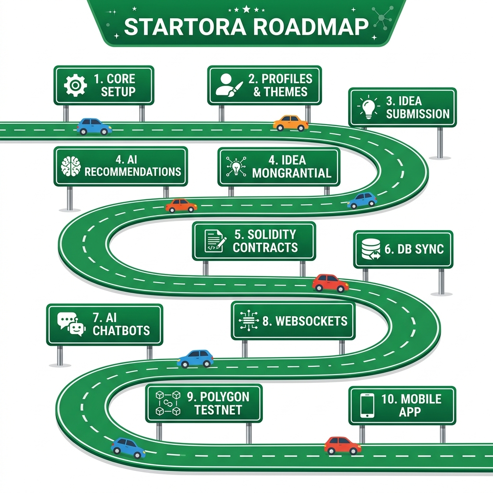

# Startora (Virtual Startup Launchpad) - Roadmap

This roadmap details the milestones and future developmental plans for the **Virtual Startup Launchpad (Startora)** ecosystem. We divide our goals into completed foundations, short-term database synchronization, mid-term gamification additions, and long-term decentralized/mobile scaling.

---

## 🗺️ Visual Winding Roadmap

Below is the winding highway roadmap showcasing our progress and future steps:



---

## 🛣️ Interactive Winding Path

This interactive diagram represents the exact winding progression of the platform:

```mermaid
flowchart TD
    %% Styling definitions (mimicking green highway signs)
    classDef completed fill:#1b4332,stroke:#52b788,stroke-width:3px,color:#fff,font-weight:bold;
    classDef current fill:#7f4f24,stroke:#d4a373,stroke-width:3px,color:#fff,font-weight:bold;
    classDef planned fill:#1f2937,stroke:#9ca3af,stroke-width:2px,color:#9ca3af,font-weight:bold;
    
    subgraph Row1 ["🏁 Row 1: Foundations"]
        direction LR
        step1["🟢 1. Core Setup<br/>(Express / React Gateway)"] -->|🚗| step2["🟢 2. Profiles & Themes<br/>(Neon Glowing UI)"] -->|🚗| step3["🟢 3. Idea Submission<br/>(Incubator Pitches)"]
    end

    subgraph Row2 ["🤖 Row 2: Intelligence & Blockchain"]
        direction RL
        step4["🟢 4. AI Recommendations<br/>(FastAPI Matching)"] <--|🚗| step5["🟢 5. Solidity Contracts<br/>(IP Hashing On-Chain)"] <--|🚗| step6["🟡 6. DB Sync & Fallback<br/>(Current Focus)"]
    end
    
    subgraph Row3 ["💬 Row 3: Interaction & Web3"]
        direction LR
        step7["🔵 7. AI Chatbots<br/>(Incubator Mentors)"] -->|🚗| step8["🔵 8. WebSockets Chat<br/>(Real-Time Channels)"] -->|🚗| step9["🔵 9. Polygon Testnet<br/>(Decentralized DAO)"]
    end
    
    subgraph Row4 ["📱 Row 4: Native Experience"]
        direction RL
        step10["🔵 10. Mobile App<br/>(Capacitor Wrapper)"]
    end

    %% Connections between rows to form the winding S-curve
    step3 -->|🛣️| step6
    step4 -->|🛣️| step7
    step9 -->|🛣️| step10
    
    class step1,step2,step3,step4,step5 completed;
    class step6 current;
    class step7,step8,step9,step10 planned;
```

---

## 🚀 Detailed Milestones & Checklists

### 🟢 Completed Milestones (1 - 5)
1. **Core Setup & Infrastructure**: Setup local Express backend, React frontend, routing, base layouts, and JWT-based user authentication.
2. **Profiles & Customization**: Added role-based SVG character avatars, neon profile glow choices, custom social links, and the 50 Launchpad Coins profile completion bonus.
3. **Idea Pitch Submission**: Created forms for pitching startup concepts categorized by domain with community voting features.
4. **AI Recommendation Engine**: Deployed FastAPI Python module matching students with complementary teammates and communities.
5. **Solidity Smart Contracts**: Developed the core blockchain layer for generating unique intellectual property hashes on-chain.

---

### 🟡 Milestone 1: Stabilization & Core Refinement (Short-term)
*Focus: Security, database reliability, and responsive UI polish.*

- [ ] **Dual-mode DB Fallback (Sign 6)**:
  - Stabilize database sync when transitioning between local JSON files and MongoDB Atlas.
  - Implement automatic data synchronization once connection to MongoDB is restored.
- [ ] **Comprehensive API Testing**:
  - Add integration tests for backend JWT authentication routes.
  - Write unit tests for the AI Recommendation engine inputs.
- [ ] **Enhanced Input Validation**:
  - Integrate request validation middleware (e.g., `Joi` or `express-validator`) for registration, project submission, and profile changes.
- [ ] **Responsive Design Polish**:
  - Improve mobile viewing grids for the Startup Dashboard and Profile modals.

---

### 🔵 Milestone 2: Interactive Features & Gamification (Medium-term)
*Focus: Engaging features, community building, and real-time interaction.*

- [ ] **AI-Powered Virtual Incubator Chatbots (Sign 7)**:
  - Introduce interactive chatbot agents for community channels, advising teams based on market-specific startup models.
  - Utilize FastAPI backend to load pre-trained models or external startup knowledge graphs.
- [ ] **Real-Time WebSockets Messaging (Sign 8)**:
  - Integrate `Socket.io` into Express backend and React frontend.
  - Add live typing indicators, read receipts, and direct messaging channels between startup teammates.
- [ ] **Launchpad Coin Economy Upgrades**:
  - Expand gamified tasks: "Daily login bonuses", "Answering 3 questions in community chats", "Releasing an idea update".
  - Build an interactive **Store Dashboard** where students can redeem coins for platform badges, profile glowing themes, or proposal voting boosts.
- [ ] **Teammate Finder UI**:
  - Build a swiper-style or card-based deck in React to filter and match student profiles with matching developer/designer skills.

---

### 🔵 Milestone 3: Decentralization & Mobile (Long-term)
*Focus: Web3 features, production deployment, and mobile application.*

- [ ] **Polygon Amoy Testnet Integration (Sign 9)**:
  - Deploy standard Solidity Smart Contracts (Idea registry, DAO Voting) to the Polygon Amoy testnet.
  - Switch frontend contract addresses to use deployed testnet hashes and configure automatic MetaMask RPC switching.
- [ ] **IPFS File Hosting**:
  - Upload startup whitepapers, slide decks, and SVG avatars directly to IPFS (InterPlanetary File System) to ensure total decentralized storage.
- [ ] **Capacitor Mobile App Deployment (Sign 10)**:
  - Build and wrap the frontend using `@capacitor/core` and `@capacitor/cli` for Android and iOS devices.
  - Implement native mobile push notifications for community updates and coin achievements.
- [ ] **Multi-DAO Governance**:
  - Establish custom DAO sub-communities allowing individual communities to write their own bylaws, vote on specialized rewards, and manage internal coin pools.

---

## 📈 Suggesting Changes

We run this roadmap dynamically! If you think a feature is missing or should be prioritized:
1. Open an issue under the `roadmap` category.
2. Discuss feasibility in the community.
3. Check the [Contributing Guide](CONTRIBUTING.md) to start coding your suggestion.
